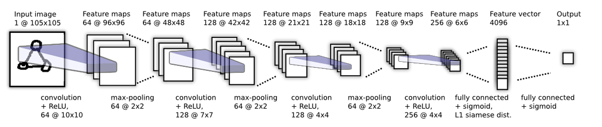
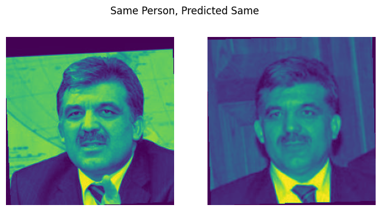
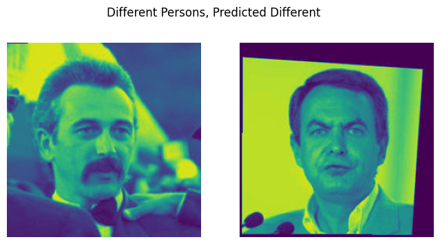
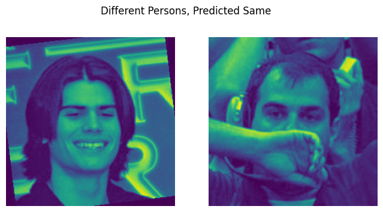
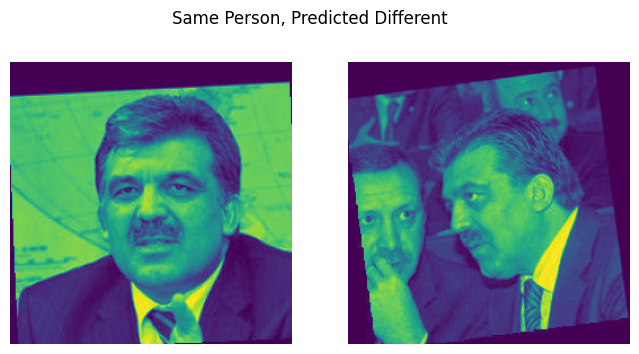

# Deep Learning HW2 – Face Verification Using Siamese Networks

### 👥 Authors:
- **Ariel Siman Tov** – 209449821  
- **Tal Klein** – 209234103

---

## 🧠 Project Overview

This project focuses on training a **Siamese Neural Network** on the [LFW-a Dataset](http://vis-www.cs.umass.edu/lfw/) to verify whether two face images belong to the same person. The network learns a similarity function rather than a direct classification.

---

## 📁 Dataset Summary

- **Dataset**: Labeled Faces in the Wild-a (LFW-a)
- **Total People**: 5749  
- **Total Images**: 13,233 (Grayscale)  
- **Train Pairs**: 2200  
- **Test Pairs**: 1000  
- **Split**: 80/20 Train/Val from Train Set

> 📷 Example Images:
> 
> 

---

## 🛠 Preprocessing Pipeline

1. **Pair Parsing**: Using `parse_pairs_file()` to extract image paths and labels.
2. **Image Transformation**:
   - Convert to grayscale  
   - Resize to `250x250`  
   - Normalize and convert to tensor
3. **Custom Dataset Class**: `LFWDataset`
   - Returns `(img1, img2, label)`
   - Label: `1 = same person`, `0 = different people`
4. **Train/Val/Test Splitting**:
   - 90/10 split in train set (balanced labels)
5. **DataLoader**:
   - Batch size = 32
   - Iterates over pair samples

---

## 🧱 Model Architecture

The model is a **Siamese CNN** consisting of:

- 8 convolutional layers  
- `ReLU` activations  
- 3 × MaxPooling  
- 1 × Fully Connected layer  
- Adapted kernel sizes: `25×25`, `18×18`, `10×10` (due to input size 250×250)

> 🧩 Architecture Illustration:  
> 

---

## ⚙️ Training Configuration

- **Batch Sizes**: 32, 64  
- **Optimizers**: SGD, Adam  
- **Loss Function**: `Binary Cross Entropy`  
- **Learning Rate**: 0.01  
- **Scheduler**: `StepLR`  
- **Epochs**: Up to 15 (with early stopping)  
- **Dropout**: Used in some experiments (rate = 0.4)

---

## 🔬 Experiments Summary

| Exp | Optimizer | Batch | BN | Dropout | Test Acc. | Train Acc. |
|-----|-----------|-------|----|---------|-----------|------------|
| 1   | SGD       | 32    | ❌ | ❌      | 68.7%     | 80.1%      |
| 2   | SGD       | 32    | ✅ | ❌      | **72.9%** | 85.5%      |
| 3   | SGD       | 64    | ✅ | ❌      | 72.0%     | 90.5%      |
| 4   | Adam      | 32    | ✅ | ❌      | 54.2%     | 65.5%      |
| 5   | Adam      | 64    | ✅ | ❌      | 52.2%     | 63.2%      |
| 6   | SGD       | 32    | ✅ | ✅      | 59.0%     | 72.5%      |

---

## 📊 Key Insights

- **BatchNorm**: Boosted accuracy and convergence (especially Exp 2 vs. Exp 1)
- **SGD vs. Adam**: SGD outperformed Adam in both convergence and accuracy
- **Dropout**: Reduced overfitting slightly (Exp 6), but aggressive dropout can hurt
- **Batch Size**: Smaller batch size helped generalization (32 > 64)
- **Kernel Sizes**: Larger receptive fields improved performance for 250×250 input

---

## ✅ Prediction Examples

> Correct (True Positive):  
> 

> Correct (True Negative):  
> 

> ❌ Incorrect (False Positive):  
> 

> ❌ Incorrect (False Negative):  
> 

---

## 🚀 Future Work

- Try additional optimizers: RMSProp, Lookahead  
- Add data augmentation for generalization  
- Implement deeper networks like ResNet Siamese  
- Hyperparameter optimization for learning rate and dropout

---

## 📎 Appendix

> 📋 Table of results extracted from model outputs:  
> 

---

## 📧 Contact

For questions or collaboration, please reach out to:  
- **Ariel Siman Tov**  
- **Tal Klein**

---

